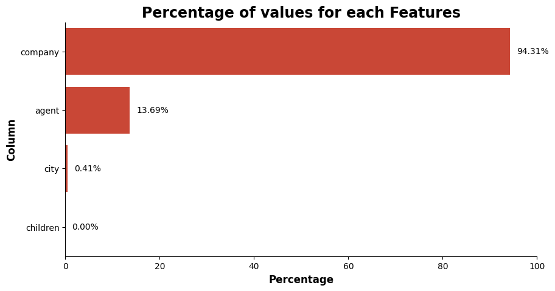
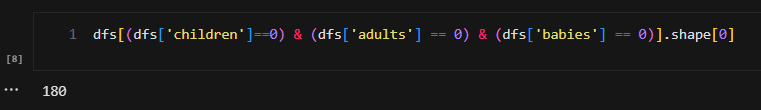
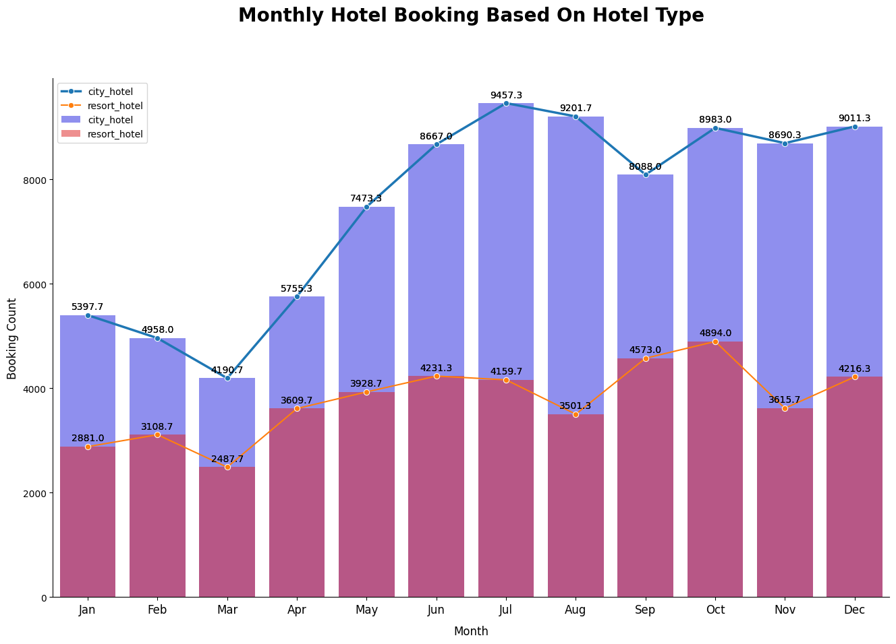
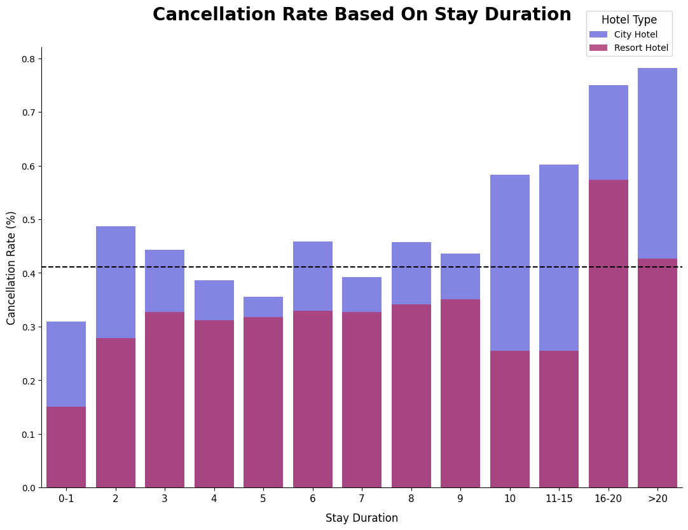
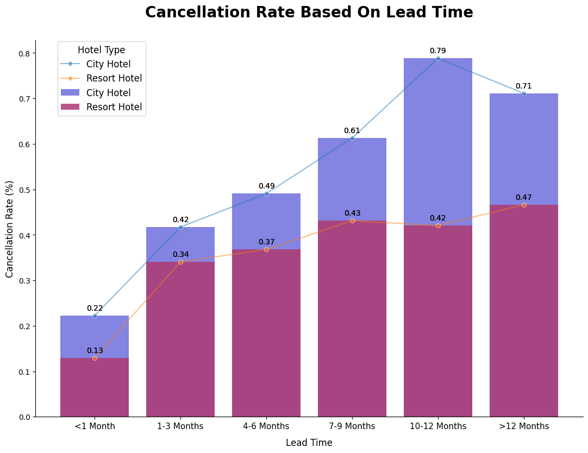

<p align="center">
  <a href="#">
    
    
    
    
    
    
    
    
    
  </a>
</p>

#  Mini Project 2: Investigate Business Hotel using Data Visualization 

<p align="center">
    
</p>

Photo by <a href="https://unsplash.com/@bugaiova_valeriya?utm_content=creditCopyText&utm_medium=referral&utm_source=unsplash">Valeriia Bugaiova</a> on <a href="https://unsplash.com/photos/a-large-swimming-pool-surrounded-by-palm-trees-_pPHgeHz1uk?utm_content=creditCopyText&utm_medium=referral&utm_source=unsplash">Unsplash</a>
  

## Table of Contents 📚
1. [Introduction](#introduction)
2. [Installation](#installation)
3. [Usage](#usage)
4. [Data Preparation](#data-preparation)
5. [Data Visualization](#data-visualization)
6. [Recommendations](#recommendations)
7. [Conclusion](#conclusion)
8. [Acknowledgements](#acknowledgements)

## Introduction 📝
### Project Overview 🔍
In this project, I will investigate the business hotel using data visualization. The dataset is provided from [Rakamin Academy](https://www.rakamin.com//) , which contains the data of hotel booking demand.<br><br>
Business hotel need to be investigated cause It is very important for a company always to analyze its business performance. On this occasion, we will delve deeper into business in the hospitality sector. Our focus is to find out how our customers behave when making hotel reservations and its relationship to the rate of cancellation of hotel reservations. We will present the results of the insights we find in data visualization to make it easier to understand and more persuasive.

### Goals of the Project 🎯
1. Find out how customers behave in making hotel reservations.
2. Find out the relationship between customer behavior in making hotel reservations and the rate of cancelation of hotel reservations.
3. Present the results of the insights we find in data visualization to make it easier to understand and more persuasive.

### Objectives of the Project 📌
1. Data Preparation
2. Data Visualization
3. Insight and Conclusion


## Installation 🔁
To run this project, you need to install the following libraries:
- pandas
- numpy
- matplotlib
- seaborn

## Usage 🪴

To run the Jupyter notebook, follow these steps:

1. Ensure that you have installed Jupyter Notebook on your machine. If not, you can install it using pip:
   ```sh
   pip install notebook
    ```
Navigate to the notebook directory and run the following command:
    
        cd notebook

Start the Jupyter Notebook server:

        jupyter notebook

The Jupyter Notebook will open in your default browser. You can click on the notebook file to open it and view the project.


## Data Preparation ⚒️

### Data Description 📃
The provided data from Rakamin Academy is about Hotel Booking Demand Data in Indonesia, The dataset size : 29 columns, and 119390 rows.
The dataset columns categories are:
- Reservation Details:
    - `hotel`: Likely a string representing the hotel name (object).
    - `is_canceled`: Indicates whether a reservation was canceled (int64).
    - `lead_time`: Time difference between reservation and arrival (int64).
    - `arrival_date_year` (int64), `arrival_date_month` (object - likely string),`arrival_date_week_number` (int64),`arrival_date_day_of_month` (int64):

- Information about arrival date.
    - `stays_in_weekend_nights` (int64), `stays_in_weekdays_nights` (int64): Number of nights spent on weekends and weekdays.

- Guest Information:
    - `adults` (int64), `children` (float64),`babies` (int64): Number of adults, children, and babies in the reservation.

- Booking Details:
    - `meal` (object - likely string representing meal plan).
    - `market_segment` (object), distribution_channel (object): Segments and channels used for booking.
    - `is_repeated_guest` (int64): Indicates if the guest has booked before.
    - `previous_cancellations` (int64), previous_bookings_not_canceled (int64): Guest's cancellation and booking history.
    - `booking_changes` (int64): Number of changes made to the booking.
    - `deposit_type` (object - likely string representing deposit type).
    - `days_in_waiting_list` (int64): Time spent on waiting list (if applicable).
    - `customer_type` (object - likely string representing customer type).

- Reservation Revenue:
    - `adr` (float64): Average Daily Rate.

- Additional Information:
    - `required_car_parking_spaces` (int64): Number of parking spaces requested.
    - `total_of_special_requests` (int64): Number of special requests made.
    - `reservation_status` (object - likely string representing reservation status).

### Data Cleaning 🧹

There's 4 columns that have missing values as seen the table below:
<p align="left">
    
</p>

The handling missing values method is :
- Column with 94% missing values which is `company` column is dropped.
- For the numerical values `agent`, `children` are filled with 0 (zero) because it's more reasonable by the nature of the data.
- For the categorical values `country` is filled with 'unknown' value.

#### Map/Replace Values
- Map the binary column `is_canceled` to `canceled` and `not_canceled` for easier understanding and `is_repeated_guest` to `first_time` and `repeat`.
- Replace Undefined values from `meal`, `market_segment`, `distribution_channel` to 'Other'.

#### Drop invalid rows 🫳
There rows with 0 guest (adults, children, babies), this is invalid data, so it's dropped.
<p align="left">
    
</p>

## Data Visualization 📊
Now we will visualize the data to get insights from the data. The visualization is divided into 3 parts:
1. Monthly Hotel Booking Analysis Based On Hotel Type
2. Impact Analysis Of Stay Duration On Hotel Bookings Cancellation Rates
3. Impact Analysis Of Lead Time On Hotel Bookings Cancellation Rates

### 1. Monthly Hotel Booking Analysis Based On Hotel Type
Before I do this analysis, there's some data processing steps to do for better visualization analysis:
- Create an aggregate table comparing monthly hotel bookings by hotel type.

- Order the data based on month

- Normalized the data. The data need to normalized because there's incomplete booking months from 2017 amd 2019, because of that if we don't normalize the data by dividing the 2018 booking counts by 3, the data will be misleading. [full code can be seen here](https://github.com/azaryasph/Investigate-Hotel-Business-Using-Data-Visualization/blob/main/notebook/mini_project2_notebook.ipynb)

- Aggregate SUM booking count based on hotel type and month

- Visualize the data 👇

<p align="left">
    
</p>
From this analysis The insight I found is:

- **City Hotels are booked more often than Resort Hotels** in Indonesia because the prices are more affordable and their location is in the city centre. <br> **This can be caused by people's habits** who tend to make short trips during holidays or travel out of town for work, so **they prefer to stay at City Hotels, which are located close to the centre of their activities**.

- **Seasons and holidays significantly influence hotel bookings** in Indonesia. **Starting in April, City Hotel bookings increased sharply in June-July**, while Resort Hotel bookings stagnated.<br> City Hotel bookings rise again during year-end holidays in October and December. Low prices boosted Resort Hotel bookings in September and October, but the growth was minor toward the end of the year. Seasonal marketing and pricing incentives can boost bookings for Indonesian resort hotels.

### 2. Impact Analysis Of Stay Duration On Hotel Bookings Cancellation Rates
Same as the previous analysis, there's some data processing steps to do for better visualization analysis:
- Create a new column containing stay duration

- Bin the values from stay duration column

- Create an aggregate table showing the ratio of cancelled hotel reservations to stay duration by hotel type.

- Viualize the data 👇

<p align="left">
    
</p>

in this analysis the Insight I found is:

- The **cancellation rate** for **City Hotels** is **greater and more volatile** (above AVG cancelation rate) compared to resort hotels for stays **ranging from 0 to 15 days**.

- **The cancellation rate increases significantly** for the **City Hotel** type when the **stay duration is more than 10 days**, while the Resort hotel only increase significantly when the stay duration in range 16 to >20 days.

- People booking city hotels usually book within 15 days. Flexible programs generate higher and more unexpected cancellation rates. If their trip lasts longer than 10 days, they may rent an apartment, increasing cancellations.

- Resort stays are frequently planned vacations. Therefore, cancellations within two weeks (0-15 days) are rare. Long stays (above 16 days) may be costly and need more planning. Longer resort trips are more likely to be cancelled if something unexpected happens.

### 3. Impact Analysis Of Lead Time On Hotel Bookings Cancellation Rates
The last analysis is the impact of lead time on hotel bookings cancellation rates. The data processing steps are:

- Bin the values from lead time column to create a new column containing lead time bins

- Create an aggregate table showing the ratio of canceled hotel reservations to lead time group for each hotel type. 

- Visualize the data 👇

<p align="left">
    
</p>

In this analysis the Insight I found is:

- **City hotels have greater cancellation rates than resort hotels for all lead times**. It appears that city hotel **visitors are more likely to cancel than resort guests**. This may have various causes. Business travel, which can change last minute due to meeting cancellations or schedule changes, may account for city hotel bookings. For vacations, resort stays can be scheduled earlier and are less likely to be canceled.

- **Resort hotel cancellation rates increase sharply at 1-3 months** from the previous lead time (less than 1 month), **reaching 21%**. Other than those lead-time months, the cancelation increases are stagnant. While the **City hotel cancellation rate** Across **<1 Month until 12 months keeps increasing** until more than 12 months, the cancellation rate decreases; **the sharpest cancellation rate increases on city hotel type are in 10-12 months**, the increases from the previous lead time months are **38%**.


## Recommendations 💰
### Recommendations for Monthly Hotel Booking Analysis Based On Hotel Type
- **City Hotels** :
    - Targeted Promotions for Short Stays <br>Develop special packages catering to short business trips or weekend getaways. This could include early check-in/late check-out options, bundled meals, or discounts for multi-night stays.

    - Focus on Bleisure Travel<br> Business and leisure blend in "bleisure" travel. Offer tailored experiences for work trip extenders with local attractions or businesses. This could offer reduced event tickets, co-working spaces, or gym or restaurant connections.

    - Highlight Work Amenities <br> Emphasize features that cater to business travelers, like well-equipped business centers, high-speed Wi-Fi, and on-site meeting facilities.

- **Resort Hotels**:
    - Seasonal Marketing Campaigns<br> Target marketing initiatives to emphasize the resort's seasonal attractions. Promote summer family activities, off-season wellness retreats, and Valentine's Day romance trips.

    - Dynamic Pricing Strategies<br> Develop dynamic pricing techniques to maximize revenue year-round. Reduce rates in September to attract budget-conscious vacationers.

    - Curated Experiences<br> Create unique experiences beyond lodging. This could include cooking instruction, cultural immersion, or interest-specific adventure packages.

### Recommendations for Impact Analysis Of Stay Duration On Hotel Bookings Cancellation Rates
- **City Hotels**:
    - Stricter Cancellation Policies for Longer Stays (10+ Days)<br> Consider tiered cancellation policies for reservations over 10 days. Higher cancellation costs or shorter free cancellation windows may result. To avoid disappointing guests, make the policy explicit and discuss it upfront.

    - Flexible Booking Options (0-10 Days)<br> Provide flexible booking options like free cancellation within 24 hours for shorter stays (0-10 days). This accommodates clients with unclear travel intentions and may reduce program-related cancellations.

    - Promote Staycation Packages<br> Showcase the benefits of 10-day city stays with staycation packages. Longer stays, multi-day itineraries including local sights, and spa treatments or cooking classes may be offered.

- **Resort Hotels**:
    - Offer Incentives for Longer Stays (16+ Days)<br> Encourage 16+-day resort stays with tempting incentives. Free accommodation upgrades, extended booking discounts, and loyalty points are examples.

    - Highlight Flexibility for Unexpected Events<br> Flexible booking options alleviate concerns about high expenses and cancellation risks for longer stays. This could include refundable deposits or eased cancellation policies for certain durations (e.g., cancel without penalty 30 days before arrival for stays over 16 days).

    - Target Special Interest Groups<br> Use marketing to attract digital nomads, remote professionals, and families looking for long vacations.

### Recommendations for Impact Analysis Of Lead Time On Hotel Bookings Cancellation Rates
- **City Hotels**:
    - Focus on Last-Minute Deals and Promotions<br> Recognize city hotel cancelation rates within one month of arrival. Offering last-minute offers, flash specials, or mobile-exclusive promos attracts spontaneous travelers. This can fill empty rooms and save cash from cancellations.

    - Leverage Dynamic Pricing Strategies<br> Implement dynamic pricing strategies that adjust rates based on real-time demand and lead time. As cancellation rates increase closer to arrival dates, consider lowering prices to attract last-minute bookings.

- **Resort Hotels**:
    - Highlight Flexibility for Long Lead Times<br> For guests booking resort stays with long lead times (10+ months), emphasize flexible cancellation policies or deposit options that address concerns over unforeseen circumstances.

    - Content Marketing Strategies<br> Develop engaging content marketing techniques to promote the resort's unique offerings and encourage early bookings, such as seasonal activity blogs, visitor feedback videos, and resort facility virtual tours.

## Conclusion 📝
In conclusion, the data visualization analysis provides insights into the behavior of customers in making hotel reservations and its relationship to the rate of cancellation of hotel reservations. The insights can be used to improve business performance and customer satisfaction. The recommendations provided can help hotels attract more customers and reduce cancellations. The data visualization analysis is a powerful tool for understanding customer behavior and making informed decisions.

## Acknowledgements🌟
With sincere gratitude, I would like to thank  [Rakamin Academy](https://www.rakamin.com//) and [Mr. Figarri Keisha](https://www.linkedin.com/in/figarrikeisha/) for providing me with this opportunity to work on this project. Their support has been invaluable.🙏
